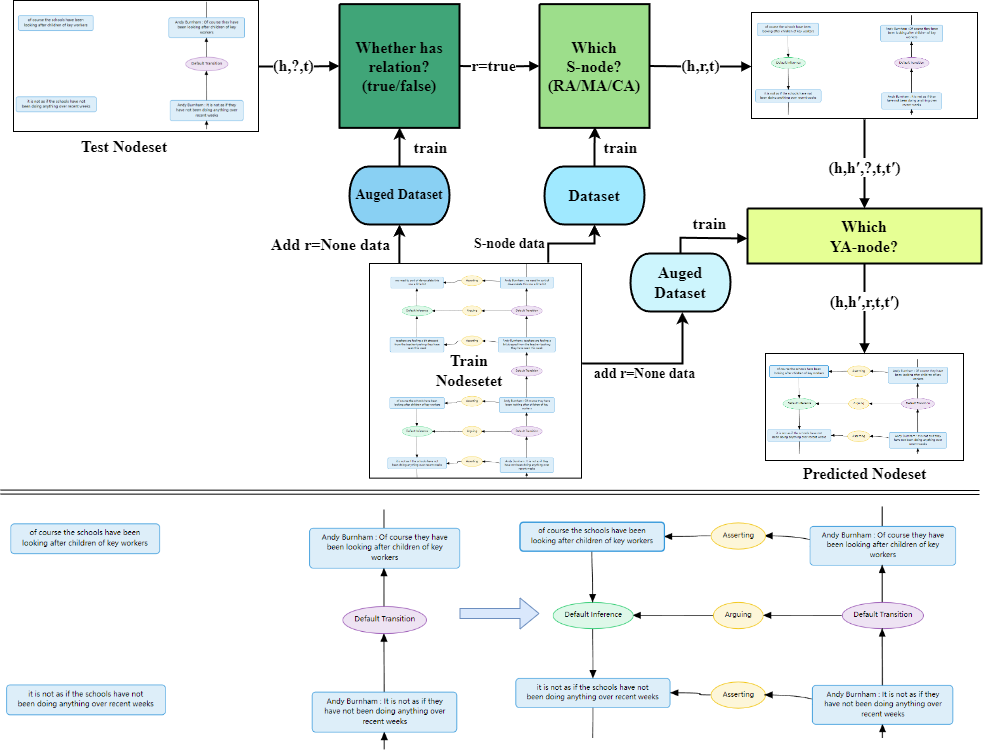

# KNOWCOMP POKEMON Team at DialAM-2024: A Two-Stage Pipeline for Detecting Relations in Dialogical Argument Mining
This is the official repository for the workshop paper in 11th Workshop on Argument Mining: KNOWCOMP POKEMON Team at DialAM-2024: A Two-Stage Pipeline for Detecting Relations in Dialogical Argument Mining. We designed a 2-stage pipeline to detect argumentative and illocutionary relations among propositions and locutions.


## Environment Preparation
Required packages are listed in ```requirements.txt```. Install the environment by running:
```bash
pip install -r requirements.txt
```

## Data Extraction
Extract training data from the original nodemap.

Firstly, extract the training data for Step 1 and Step 2 of Stage 1.
```bash
python extract_stage1.py \
--data_dir <your path of training nodemaps> \
--save_dir <your path to save extracted data> \
--step <1 or 2> \
--neg 1 \ 
--eval_rate 0.05
```

Then extract the training data for Stage2
```bash
python extract_stage2.py \
--data_dir <your path of training nodemaps> \
--save_dir <your path to save extracted data> \
--neg 1 \ 
--eval_rate 0.05
```

## Training
Train the model by using the following command.
```bash
python <training_script> \
--model_path <your model path> \
--data_path <your data dir> \
--output_dir <dir for saving checkpoint files>
```
+ For Step 1 of Stage 1, use ```snode_train_step1.py```
+ For Step 2 of Stage 1, use ```snode_train_step2.py```
+ For Stage 2, use ```ya_train.py```
